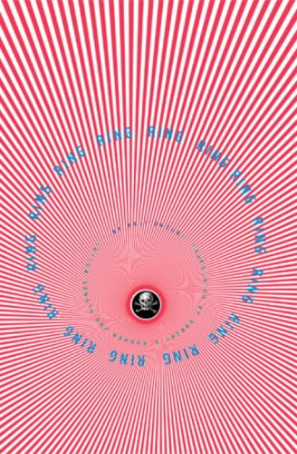

The majority of people already know the story. The American version has been seen by a lot of people, at least in the western countries. I myself remember how I couldn't fall asleep after seeing the film when I was just a kid.

The movies (the original Japanese and the American ones) do follow the book's story very closely, so it might not bring up a lot of new surprises if you decide to read it. There is a videotape, if you watch you will die in 7 days (or will you?). That's mostly the main premise, and you follow the main character investigating the videotape's backstory so he could save his life.

However, I found there was a big difference between the movies and the book. The movies felt more like horror, especially the American version. The dead girl was an actual physical monster that would kill you. Meanwhile, the book's monster never was a physical being. Seems like the videotape kills by giving you a heart attack, though characters do go through a psychological horror before dying.

So for me, that's a big difference, the book is more psychological horror than the movies. Things seem to happen more in your mind than in reality. Because of the lack of horror elements, I actually never felt scared of the dead girl. As the story unfolded, I even started feeling sorry for her.

The lack of scariness in the story didn't bother me. The videotape investigation sometimes might have felt slow, but I cared about the girl enough that I wanted to follow that investigation. I wanted to know what happened to that poor girl. So rather than being scared, I felt somewhat sad for the monster. I found her quite human.

My only disappointment was that I already knew the story quite well because I had already seen the movies. So there were very few surprises in the book, for me at least. Still, it was enjoyable to revisit this story in more detail and with somewhat different emotions than I expected.
